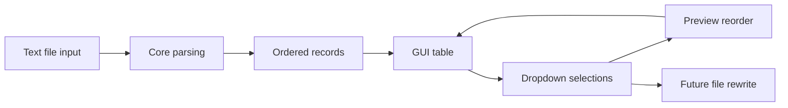

# Architecture

This repository is organized as a small Python application with a src-based package layout. The code is split so file parsing, preview logic, and the GUI remain separate and easy to extend when the write-back step is added.

## High-Level Shape

## Repository Layout

- [pyproject.toml](pyproject.toml) defines packaging metadata, the console entry point, and the optional build dependency for PyInstaller.
- [README.md](README.md) gives a short project summary and build notes.
- [QUICK_START.md](QUICK_START.md) gives the shortest path to run and package the app.
- [src/monaco_shuffler/__init__.py](src/monaco_shuffler/__init__.py) exposes the package version.
- [src/monaco_shuffler/core.py](src/monaco_shuffler/core.py) contains all parsing and reorder-preview rules.
- [src/monaco_shuffler/gui.py](src/monaco_shuffler/gui.py) contains the Tkinter interface and widget wiring.
- [src/monaco_shuffler/main.py](src/monaco_shuffler/main.py) is the application entry point.
- [src/monaco_shuffler/data/sample_layers.txt](src/monaco_shuffler/data/sample_layers.txt) provides bundled sample input.

## Runtime Layers

### 1. Data ingestion

The application reads a Monaco-style text file where each structure is stored as two lines:

1. structure name
2. layer index

The parser in [src/monaco_shuffler/core.py](src/monaco_shuffler/core.py) validates that the file contains complete name/index pairs, converts the indices to integers, and sorts the resulting records by original layer.

### 2. Domain logic

[src/monaco_shuffler/core.py](src/monaco_shuffler/core.py) owns the reorder rules:

- parse raw text into structure records
- derive default dropdown values from the original file order
- validate selected target layers
- build the preview order shown in the UI

This module is intentionally UI-agnostic so the file-writing step can reuse the same validation later.

### 3. User interface

[src/monaco_shuffler/gui.py](src/monaco_shuffler/gui.py) builds the desktop window with Tkinter.

The GUI currently provides:

- a scrollable table of structures
- the original layer number column
- a dropdown for choosing a target layer
- a preview column that shows the reordered result after confirmation
- a reset button that restores default values
- an Apply Reorder button placeholder for the future write-back step

### 4. Application startup

[src/monaco_shuffler/main.py](src/monaco_shuffler/main.py) resolves the initial file to load and starts the Tk event loop.

Startup order:

1. parse the optional `--file` argument
2. otherwise try `PretendData.txt` in the project root
3. otherwise fall back to the bundled sample data
4. launch the main window with the loaded records

## Current Behavior

The repo currently supports previewing reorderings only. The file rewrite step is not implemented yet, by design. That keeps the first milestone limited to interface layout, validation, and preview logic.

## Packaging Model

The project uses a standard Python package layout under `src/` so it can be:

- run from source during development
- installed as an editable package
- built into a Windows executable with PyInstaller

The console entry point is `monaco-shuffler`, mapped to [src/monaco_shuffler/main.py](src/monaco_shuffler/main.py).

## Extension Points

The main future addition is the write-back pipeline. When that is implemented, the same architecture should hold:

- keep Monaco file parsing in `core.py`
- keep file mutation logic in a second core service, not in the GUI
- let the GUI only collect user choices and display preview state

That separation will make it easier to support multiple Monaco file formats or additional validation rules without reworking the window code.