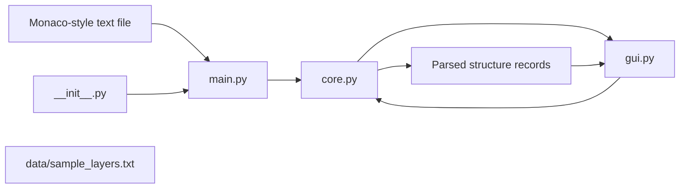

# Package Architecture

This document describes the internal structure of the `monaco_shuffler` package only.

## Package Scope

## Package Modules

- `src/monaco_shuffler/__init__.py` exposes package version metadata.
- `src/monaco_shuffler/main.py` starts the application, resolves the optional input file, and launches the GUI.
- `src/monaco_shuffler/core.py` owns parsing, validation, preview ordering, and file serialization rules.
- `src/monaco_shuffler/gui.py` renders the PySide6 window and collects user choices.
- `src/monaco_shuffler/data/sample_layers.txt` provides bundled sample input for local use and development.

## Internal Responsibilities

### `main.py`

- parses command-line arguments
- loads the selected file through the core module
- creates the Qt application and main window

### `core.py`

- locates the structure list inside a larger file
- validates record shape and sequential IDs
- builds preview order from the selected destination layers
- serializes records for save operations

### `gui.py`

- displays the current file contents as editable rows
- shows the original layer and the selected target layer
- previews the reordered result before saving
- writes the edited file and the `_OG` backup copy when saving

### `data/`

- stores sample text files bundled with the package
- keeps demo input separate from user files

## Package Data Flow

1. The app starts in `main.py`.
2. `main.py` asks `core.py` to parse the input file.
3. `core.py` returns validated structure records.
4. `gui.py` renders those records for user selection.
5. `core.py` validates and serializes the selected order.
6. `gui.py` writes the reordered file and the original backup copy.