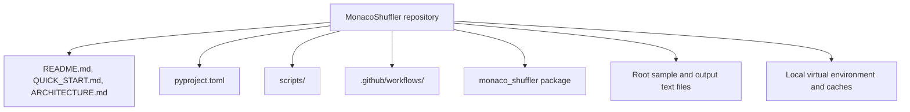

# Repository Architecture

This document describes the full repository structure at a high level.
The `monaco_shuffler` package is shown as one unit here; its internal module
details are covered in [PACKAGE_ARCHITECTURE.md](PACKAGE_ARCHITECTURE.md).

## Repository Scope

## Top-Level Layout

- `pyproject.toml` defines packaging, dependencies, and setuptools-scm versioning.
- `README.md` gives the primary project overview, release notes, and build guidance.
- `QUICK_START.md` gives the shortest path to install, run, and release the app.
- `ARCHITECTURE.md` provides the earlier high-level architecture overview.
- `PACKAGE_ARCHITECTURE.md` contains the package internals.
- `scripts/` contains local helper scripts such as the executable build script.
- `.github/workflows/` contains GitHub Actions automation for Pages and release builds.
- `src/monaco_shuffler/` contains the application package.
- Root-level `*.txt` files are sample and generated Monaco-style data files used during development.
- `shuffler_env/` is a local virtual environment and should not be committed.

## Repository-Level Responsibilities

### Documentation

The repository keeps user-facing guidance in Markdown files at the root and in `scripts/`.

### Packaging

The repository is structured as a standard `src/`-layout Python package so it can be installed in editable mode, versioned from git tags, and built into a Windows executable.

### Automation

GitHub Actions is used for tag-triggered release tasks:

- publish the GitHub Pages site
- build the Windows executable
- attach the executable to a GitHub Release

### Local Development

The `scripts/` folder supports developers who want to make code changes and build their own executable locally rather than downloading a tagged release.

## What Is Omitted Here

The internal module-level details of the `monaco_shuffler` package are intentionally left out of this document. Those details belong in [PACKAGE_ARCHITECTURE.md](PACKAGE_ARCHITECTURE.md).